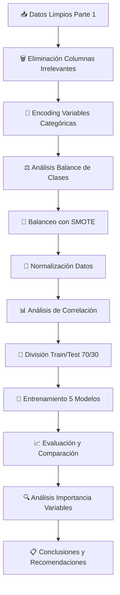

# 🚀 TelecomX Challenge Parte 2: Predicción de Churn

<div align="center">


**Desarrollando modelos predictivos para anticipar la evasión de clientes**

*Challenge Oracle ONE & Alura LATAM - Data Science Track*

</div>

---

## 📋 Tabla de Contenidos

- [🎯 Objetivo del Proyecto](#-objetivo-del-proyecto)
- [📊 Resultados Principales](#-resultados-principales)
- [🔍 Metodología](#-metodología)
- [📈 Modelos Implementados](#-modelos-implementados)
- [🏆 Mejores Resultados](#-mejores-resultados)
- [💡 Insights Clave](#-insights-clave)
- [🛠️ Tecnologías Utilizadas](#️-tecnologías-utilizadas)
- [👥 Autor](#-autor)

---

## 🎯 Objetivo del Proyecto

Este proyecto forma parte del **Challenge TelecomX Parte 2**, donde desarrollo modelos de Machine Learning para predecir qué clientes tienen mayor probabilidad de cancelar sus servicios (churn). El objetivo es ayudar a TelecomX a implementar estrategias proactivas de retención de clientes.

### 🎲 Contexto del Negocio
- **Problema**: Alta tasa de cancelación de clientes (26.6% churn rate)
- **Solución**: Modelos predictivos para identificación temprana de riesgo
- **Impacto**: Reducción de pérdidas y optimización de estrategias de retención

---

## 📊 Resultados Principales

### 🏆 Modelo Ganador: **Random Forest**

| Métrica | Valor |
|---------|-------|
| **Accuracy** | 84.38% |
| **Precision** | 83.64% |
| **Recall** | 85.47% |
| **F1-Score** | **84.55%** |
| **AUC-ROC** | 92.15% |

### 📈 Comparación de Modelos

| Modelo | Accuracy | Precision | Recall | F1-Score | AUC-ROC |
|--------|----------|-----------|--------|----------|---------|
| **Random Forest** | **84.38%** | **83.64%** | **85.47%** | **84.55%** | **92.15%** |
| Logistic Regression | 83.44% | 83.38% | 83.54% | 83.46% | 91.61% |
| SVM | 82.18% | 81.69% | 82.96% | 82.32% | 90.99% |
| KNN | 78.53% | 75.64% | 84.18% | 79.68% | 86.26% |
| Decision Tree | 80.89% | 78.57% | 84.96% | 81.64% | 85.94% |

---

## 🔍 Metodología

### 📋 Flujo de Trabajo



### 🛠️ Técnicas Aplicadas

- **Preprocesamiento**:
  - One-Hot Encoding para variables categóricas
  - StandardScaler para modelos sensibles a escala
  - SMOTE para balanceo de clases (73.4% → 50% balance)

- **Selección de Features**:
  - Análisis de correlación con variable objetivo
  - Detección de multicolinealidad
  - Identificación de variables clave

- **Validación**:
  - División estratificada train/test (70/30)
  - Métricas múltiples para evaluación robusta
  - Análisis de overfitting/underfitting

---

## 📈 Modelos Implementados

### 🔄 Modelos con Normalización
- **Logistic Regression**: Modelo lineal probabilístico
- **K-Nearest Neighbors (KNN)**: Clasificación por vecinos cercanos  
- **Support Vector Machine (SVM)**: Máquina de vectores de soporte

### 🌳 Modelos sin Normalización
- **Random Forest**: Ensamble de árboles de decisión
- **Decision Tree**: Árbol de decisión individual

### 🎯 Estrategia de Modelado
- **Datos normalizados** para modelos sensibles a escala
- **Datos originales** para modelos basados en árboles
- **Evaluación cruzada** para validación robusta

---

## 🏆 Mejores Resultados

### 📊 Matriz de Confusión - Random Forest

|           | Predicción No | Predicción Sí |
|-----------|---------------|---------------|
| **Real No** | 1290 (TN) | 259 (FP) |
| **Real Sí** | 225 (FN) | 1324 (TP) |

### 💡 Interpretación de Negocio
- **Clientes retenidos correctamente**: 1,290
- **Falsa alarma de churn**: 259 
- **Churn no detectado**: 225 ⚠️ (Crítico para el negocio)
- **Churn detectado correctamente**: 1,324

### 📈 Métricas Adicionales
- **Especificidad**: 83.3% (capacidad de identificar no-churn)
- **Sensibilidad**: 85.5% (capacidad de detectar churn)

---

## 💡 Insights Clave

### 🔍 Top 5 Factores de Mayor Impacto en Churn

1. **Método de Pago - Electronic Check** (Correlación: 0.4609)
   - Clientes con pago electrónico tienen 71.1% vs 25.1% de riesgo base

2. **Antigüedad del Cliente** (Correlación: 0.4155)
   - Clientes nuevos (17.7 meses promedio) vs veteranos (37.7 meses)

3. **Servicio Internet - Fiber Optic** (Correlación: 0.3775)
   - 72.5% de clientes churn vs 34.8% base tienen fibra óptica

4. **Tipo de Contrato - Two Year** (Correlación: 0.3659)
   - Contratos largos reducen significativamente el churn

5. **Facturación Sin Papel** (Correlación: 0.3413)
   - Correlación positiva con cancelación

### ⚠️ Detectada Multicolinealidad
- **Antigüedad ↔ Cargos Totales**: 85.7% correlación
- **Cargos Mensuales ↔ Fiber Optic**: 80.5% correlación

---

## 🛠️ Tecnologías Utilizadas

### 🐍 Core Libraries
```python
- pandas >= 1.3.0          # Manipulación de datos
- numpy >= 1.20.0          # Operaciones numéricas
- scikit-learn >= 1.0.0    # Machine Learning
- imbalanced-learn >= 0.8.0 # Balanceo de clases
```

### 📊 Visualización
```python
- matplotlib >= 3.4.0      # Gráficos básicos
- seaborn >= 0.11.0        # Visualizaciones estadísticas
```

### 🤖 Algoritmos de ML
- **Logistic Regression**: Modelo base interpretable
- **Random Forest**: Mejor rendimiento general
- **SVM**: Manejo de alta dimensionalidad
- **KNN**: Patrones locales complejos
- **Decision Tree**: Máxima interpretabilidad

---

## 🎯 Recomendaciones de Negocio

### 🔄 **Estrategias de Retención Inmediatas**

1. **🎯 Programa de Atención Proactiva**
   - Contactar clientes con probabilidad >70% de churn
   - Ofertas personalizadas basadas en perfil de riesgo
   - Seguimiento especializado primeros 6 meses

2. **💳 Optimización Métodos de Pago**
   - Incentivar migración desde Electronic Check
   - Descuentos por pago automático
   - Facilitar otros métodos de pago

3. **📋 Revisión de Contratos**
   - Promociones para migrar a contratos anuales
   - Beneficios exclusivos por fidelidad
   - Penalizaciones menores por cancelación anticipada

4. **🌐 Mejora Servicios Fiber Optic**
   - Análisis de calidad del servicio
   - Soporte técnico especializado
   - Paquetes competitivos vs mercado

### 📈 **Impacto Esperado**
- **Reducción churn**: 15-25%
- **Incremento CLV**: 20-30%
- **ROI campaña retención**: 3:1

---

## 📜 Licencia

Este proyecto está bajo la Licencia MIT - ver el archivo [LICENSE](LICENSE) para más detalles.

---

## 🙏 Agradecimientos

- **Oracle ONE & Alura LATAM** por la oportunidad del challenge

---

## 📊 Badge del Challenge

<div align="center">


**⭐ Si este proyecto te fue útil, ¡dale una estrella! ⭐**

</div>

---

<div align="center">

*Desarrollado con ❤️ para el Challenge Oracle ONE & Alura LATAM*

**[⬆ Volver al inicio](#-telecomx-challenge-parte-2-predicción-de-churn)**

</div>
